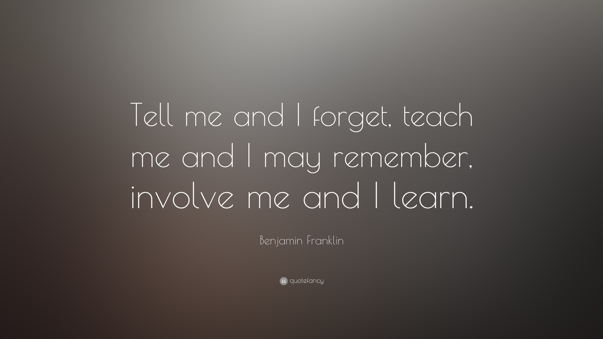

# **"Understanding Real-World Concurrency Bugs in Go"**

> This is my small gift to gophers who are reading or will read this paper: learn concurrency through its pitfalls. This will help you learn by actually running buggy code, fixing it, and truly understanding along the way. 

---

This repository contains my hands-on notes, and runnable code while studying and implementing concepts from the famous research paper **"Understanding Real-World Concurrency Bugs in Go"**. 

This repo acts as my personal notebook while reading the paper documenting what breaks, why it breaks, and what actually works in practice. There are some of new learnings
which i got with other blogs are also added here and i have also added summary of the paper that what all i learned !!

Happy Learning Anon !!

